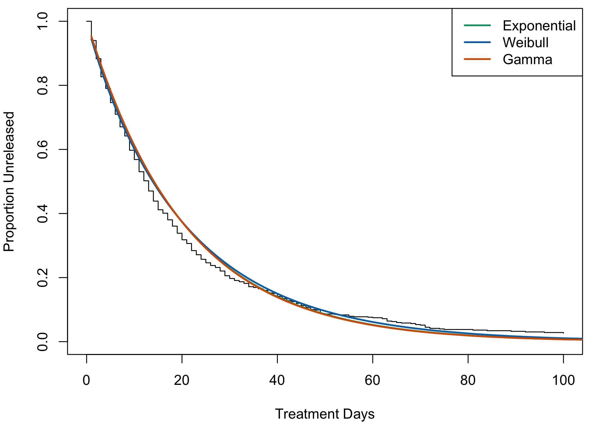
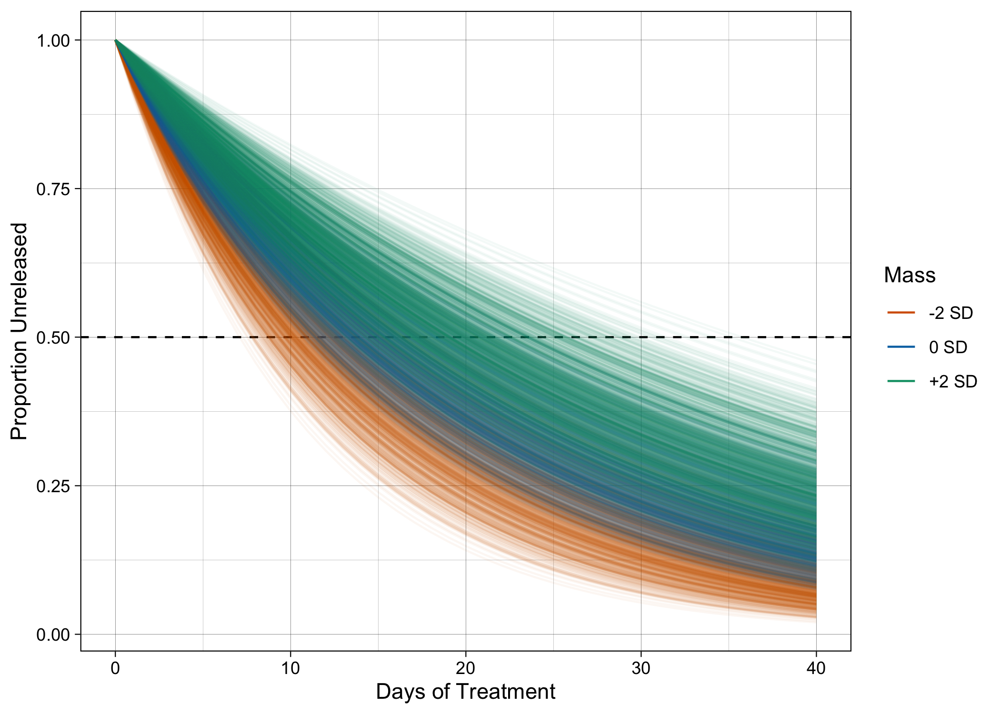
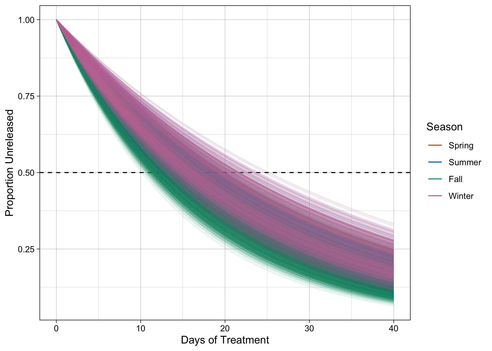

Avian Window Collisions
================
Mason Youngblood


## Intro

These avian window collision data were collected by Ar Kornreich from
various states in the northeastern US. The data are comprised of
individual cases of birds that were brought into rehabilitation centers,
with information about species, age, sex, injuries, and the number of
days that they survived. We will be identifying the major drivers of
rehabilitation in two ways: (1) using logistic and Poisson models of
release and treatment time, and (2) using a right-censored survival
model of treatment time where the censored cases are those where birds
died and could not be released.[^1] All models will be run in `Stan`
using `brms`.

For the survival analysis, we will be using the parameteric approach in
`brms` described by [A. Solomon
Kurz](https://bookdown.org/content/4857/god-spiked-the-integers.html#bonus-survival-analysis)
and inspired by [Richard
McElreath](https://youtu.be/p7g-CgGCS34?t=1424).[^2] We will start out
with the exponential distribution, which is often used to model survival
data because it fits the waiting times for events from a [Poisson
distribution](https://stats.stackexchange.com/questions/2092/relationship-between-poisson-and-exponential-distribution),
but we will also use the [Weibull and Gamma
distributions](https://onlinelibrary.wiley.com/doi/10.1111/eth.13225).[^3]

The specification for an exponential survival model with a log link
function is as follows:

$$
\displaylines{
T_i|D_i = 1 \sim \mbox{Exponential}(\lambda_i)\\
T_i|D_i = 0 \sim \mbox{Exponential-CCDF}(\lambda_i)\\
\lambda_i = 1/\mu_i\\
\mbox{log } \mu_i = \mbox{...}}
$$

Where *T* is treatment time, *D* is whether the bird died (1) or was
released (0), and “…” is the rest of the model specification. Death (*D*
= 1) is modeled with an exponential function, whereas release (*D* = 0)
is modeled with a exponential complementary cumulative distribution
function (CCDF). CCDF functions are used to model the probability that
the even has *not* yet happened. The Weibull and Gamma versions of the
model only vary in the distribution family of the top two lines. We will
also check whether it makes sense to do the analysis where *D* is
whether the bird died (0) or was released (1), so where release is
censored rather than death.

It is important to note that our data violate the assumption of
[non-informative](https://www.ncbi.nlm.nih.gov/pmc/articles/PMC3275994/)
[censoring](https://www.nature.com/articles/s41571-020-0368-0), or the
assumption that the censored variable (death) is independent of the
event variable (release). This is because birds that die presumably had
worse injuries or health, and would have taken longer to be released if
they had survived. There are
[several](https://onlinelibrary.wiley.com/doi/10.1002/sim.6274)
[imputation](https://onlinelibrary.wiley.com/doi/10.1002/sim.3480)
[methods](https://academic.oup.com/biostatistics/article/13/2/341/263988)
that replace the event times of censored cases to account for bias
introduced by non-informative censoring, including the R package
`InformativeCensoring`. Unfortunately, these methods are designed for
cases where full data are available, or where missing data imputation is
not in use. In this study we will not be using specialized imputation
for informative censoring, so the overall release curves will be
systematically biased towards shorter times. We do not have a reason to
expect this to bias predictor estimates.

## Data Cleanup

Let’s load the packages we need and the data.

``` r
#load packages
library(brms)
library(mice)
library(ggplot2)
library(dagitty)
library(ggdag)
library(survival)
library(ggfortify)
library(ggrepel)
library(flexsurv)
library(bayesplot)
library(cowplot)

#load data
raw_data <- read.csv("Window.Collision.R-Ready.res.csv")
```

Here is a plot of the familes we have in the data.

``` r
#using code adapted from ar
wincol <- raw_data[!(raw_data$MayHBC == "TRUE"), ]
fam_mass <- aggregate(wincol$Avg.Sp.Mass.g, by = list(wincol$Family), FUN = mean, na.rm = TRUE, na.action = NULL, nfrequency = 1)
fam_mass$Freq <- table(wincol$Family)
ggplot(fam_mass, aes(x, Freq, label = Group.1)) + 
  geom_text_repel(size = 3) + scale_x_continuous(trans = "log10") + 
  scale_y_continuous(trans = "log10", limits = c(0.8, 460)) + 
  xlab("Average Mass (g) ") + ylab("Number of Cases") + theme_linedraw(base_size = 9) + 
  annotation_logticks()
```

<!-- -->

Before moving forward, we should think about the causal structure of the
data. Below is a directed acyclic graph (DAG) of the variables for which
we have decent coverage. The red node is our outcome variable, survival
time, the black nodes comprise the adjustment set needed to estimate the
effects of funding, mass, and age on survival time, and the gray nodes
are the variables that are unnecessary to include.

<!-- -->

According to the results of `adjustmentSets`, we do not need to
condition on any other variables besides our exposure variables (in
blue) to estimate their causal effects on our outcome variable (in
red).[^4] So we will only include mass, funding, season, and age in the
modeling, but will keep the other variables for imputation.

Let’s move on to subsetting and cleaning the data. We will temporarily
replace and/or remove some of the incorrectly formatted data until we
have the finalized version.

``` r
#subset data
data <- data.frame(treatment = raw_data$Treatment.Time,
                   mass = raw_data$Avg.Sp.Mass.g,
                   species = raw_data$Species,
                   family = raw_data$Family,
                   age = raw_data$Age,
                   sex = raw_data$Sex,
                   funding = raw_data$RhbFund,
                   org = raw_data$Facility,
                   state = sapply(1:nrow(raw_data), function(x){substr(raw_data$Location[x], nchar(raw_data$Location[x])-1, nchar(raw_data$Location[x]))}),
                   season = raw_data$Season,
                   death = ifelse(raw_data$Disposition %in% c("Dead on Arrival", "Died", "Euthanized"), 1, 0),
                   release = ifelse(raw_data$Disposition %in% c("Kept for Education", "Released"), 1, 0))

#add +1 to treatment times to there are no zeros
data$treatment <- data$treatment + 1

#replace uncertain species with NA and convert to factor
data$species[which(nchar(data$species) != 4)] <- NA
data$species <- factor(data$species)

#convert state, family, season, and organization to factor
data$state <- factor(data$state)
data$family <- factor(data$family)
data$org <- factor(data$org)
data$season <- factor(data$season, levels = c("Spring", "Summer", "Fall", "Winter"))

#clean up age and sex and convert to factors
data$age[which(data$age == "Unknown")] <- NA
data$sex[which(data$sex == "Unknown")] <- NA
data$age <- factor(data$age, levels = c("Juvenile", "Adult"))
data$sex <- factor(data$sex)

#scale mass and funding
data$mass <- as.numeric(scale(data$mass))
data$funding <- as.numeric(scale(data$funding))
```

## Imputation

There are several variables for which we have incomplete data: state
(0%), age (43%), organization type (14%), funding (17%), treatment time
(17%), and sex (90%). Sex is missing far too much of the data and will
be excluded from analysis. For everything else, we will handle
missingness using the multiple imputation approach recommended by [Paul
Bürkner](https://cran.r-project.org/web/packages/brms/vignettes/brms_missings.html#imputation-before-model-fitting).
First, we will use multiple imputation with random forest machine
learning to generate 10 different imputed versions of our data. Then, we
will fit our models to each imputed dataset separately and pool the
results across all of the models.

Let’s impute our 10 datasets and save them for future use.

``` r
#run imputation
set.seed(12345)
num_imp <- 10
imp_data <- mice(data[, c(1, 2, 5, 7, 10:12)], method = "rf", m = num_imp)

#save imputed data
save(imp_data, file = "imp_data.RData")
```

## Logistic & Poisson Models

``` r
#run logistic model with release as outcome variable
release_model <- brm_multiple(data = imp_data,
                              family = bernoulli(link = "logit"),
                              release ~ mass + age + funding + season,
                              cores = 4, chains = 4, iter = 5000,
                              prior = c(set_prior("normal(0, 0.5)", class = "b")))

#run poisson model with treatment time as outcome variable
treatment_model <- brm_multiple(data = imp_data,
                                family = poisson,
                                treatment ~ mass + age + funding + season,
                                cores = 4, chains = 4, iter = 5000,
                                prior = c(set_prior("normal(0, 0.5)", class = "b")))

#save models
standard_models <- list(release = release_model, treatment = treatment_model)
save(standard_models, file = "standard_models.RData")
```

|                |  Est. |  2.5% | 97.5% |     |
|:---------------|------:|------:|------:|:----|
| Mass           |  0.14 |  0.05 |  0.24 | \*  |
| Age            |  0.13 | -0.07 |  0.34 |     |
| Funding        | -0.04 | -0.12 |  0.04 |     |
| Season: Summer | -0.47 | -0.70 | -0.23 | \*  |
| Season: Fall   |  0.02 | -0.18 |  0.22 |     |
| Season: Winter |  0.24 | -0.01 |  0.48 |     |

Release Model

|                |  Est. |  2.5% | 97.5% |     |
|:---------------|------:|------:|------:|:----|
| Mass           |  0.09 |  0.08 |  0.10 | \*  |
| Age            | -0.20 | -0.31 | -0.09 | \*  |
| Funding        | -0.01 | -0.04 |  0.03 |     |
| Season: Summer | -0.30 | -0.42 | -0.19 | \*  |
| Season: Fall   | -0.12 | -0.18 | -0.05 | \*  |
| Season: Winter |  0.30 |  0.24 |  0.38 | \*  |

Treatment Model

As described above, the Rhats from `brm_multiple` are unreliable so we
have to check the Rhats for each of the 10 imputed datasets, which are
all approaching 1.

``` r
#get rhats from release submodels
rls_rhats <- release_model$rhats[, 2:7]
rls_rhats <- cbind(1:10, rls_rhats)
colnames(rls_rhats) <- c("Imputation", "Mass", "Age", "Funding", "Season: Summer", "Season: Fall", "Season: Winter")
knitr::kable(rls_rhats, digits = 4, caption = "Release Rhats")
```

| Imputation |   Mass |    Age | Funding | Season: Summer | Season: Fall | Season: Winter |
|-----------:|-------:|-------:|--------:|---------------:|-------------:|---------------:|
|          1 | 0.9997 | 0.9996 |  1.0000 |         1.0001 |       1.0005 |         1.0002 |
|          2 | 0.9997 | 0.9997 |  0.9997 |         0.9999 |       0.9997 |         1.0002 |
|          3 | 1.0001 | 1.0000 |  0.9998 |         0.9997 |       0.9999 |         1.0000 |
|          4 | 0.9997 | 0.9997 |  0.9998 |         1.0000 |       1.0002 |         0.9998 |
|          5 | 0.9998 | 0.9997 |  0.9999 |         1.0000 |       0.9998 |         0.9998 |
|          6 | 1.0000 | 1.0001 |  0.9998 |         0.9998 |       1.0002 |         1.0001 |
|          7 | 0.9999 | 1.0000 |  1.0000 |         1.0000 |       1.0002 |         1.0000 |
|          8 | 0.9998 | 0.9999 |  0.9999 |         0.9998 |       0.9997 |         1.0003 |
|          9 | 0.9998 | 0.9998 |  0.9998 |         0.9998 |       0.9999 |         0.9999 |
|         10 | 1.0001 | 0.9999 |  0.9998 |         1.0002 |       1.0002 |         1.0001 |

Release Rhats

``` r
#get rhats from treatment submodels
trt_rhats <- treatment_model$rhats[, 2:7]
trt_rhats <- cbind(1:10, trt_rhats)
colnames(trt_rhats) <- c("Imputation", "Mass", "Age", "Funding", "Season: Summer", "Season: Fall", "Season: Winter")
knitr::kable(trt_rhats, digits = 4, caption = "Treatment Rhats")
```

| Imputation |   Mass |    Age | Funding | Season: Summer | Season: Fall | Season: Winter |
|-----------:|-------:|-------:|--------:|---------------:|-------------:|---------------:|
|          1 | 1.0000 | 0.9999 |  0.9999 |         1.0003 |       1.0001 |         0.9999 |
|          2 | 1.0001 | 0.9997 |  1.0000 |         0.9999 |       0.9999 |         0.9999 |
|          3 | 0.9997 | 0.9999 |  0.9998 |         0.9999 |       1.0000 |         0.9998 |
|          4 | 0.9996 | 1.0004 |  1.0003 |         1.0000 |       0.9999 |         0.9998 |
|          5 | 0.9999 | 0.9997 |  0.9997 |         1.0002 |       1.0000 |         0.9999 |
|          6 | 0.9997 | 0.9998 |  1.0000 |         1.0000 |       1.0000 |         1.0000 |
|          7 | 0.9998 | 0.9999 |  0.9997 |         1.0009 |       1.0000 |         1.0000 |
|          8 | 0.9999 | 1.0002 |  0.9998 |         0.9999 |       1.0001 |         1.0000 |
|          9 | 1.0000 | 0.9998 |  1.0000 |         1.0000 |       1.0001 |         1.0001 |
|         10 | 1.0000 | 1.0001 |  0.9998 |         1.0001 |       0.9998 |         0.9998 |

Treatment Rhats

<!-- -->

## Survival Models

Before constructing our full survival models, let’s run frequentist
versions using one of the imputed datasets to see how well the
exponential, Weibull, and Gamma distributions fit the data. With `Surv`
from `flexsurvreg`, [the first argument is the treatment time and second
is 1 if the event of interest and 0 if
censored](https://www.emilyzabor.com/tutorials/survival_analysis_in_r_tutorial.html).

``` r
#create one complete imputed dataset
imp_data_comp <- complete(imp_data)

#run three frequentist survival models where death is censored
freq_exp <- flexsurvreg(Surv(treatment, release) ~ 1, data = imp_data_comp, dist = "exponential")
freq_wei <- flexsurvreg(Surv(treatment, release) ~ 1, data = imp_data_comp, dist = "weibull")
freq_gam <- flexsurvreg(Surv(treatment, release) ~ 1, data = imp_data_comp, dist = "gamma")

#run three frequentist survival models where release is censored
freq_exp_alt <- flexsurvreg(Surv(treatment, death) ~ 1, data = imp_data_comp, dist = "exponential")
freq_wei_alt <- flexsurvreg(Surv(treatment, death) ~ 1, data = imp_data_comp, dist = "weibull")
freq_gam_alt <- flexsurvreg(Surv(treatment, death) ~ 1, data = imp_data_comp, dist = "gamma")
```

<!-- -->

<!-- -->

Only the models where death is censored and release is the outcome fit
the data, so we will move forward accordingly.

``` r
#compare AIC for three models
AIC(freq_exp, freq_wei, freq_gam)
```

    ##          df      AIC
    ## freq_exp  1 9641.189
    ## freq_wei  2 9633.831
    ## freq_gam  2 9643.044

All three do a decent job but the Weibull model has the lowest AIC.
Let’s check the output of the full frequentist Weibull model with
predictors.

``` r
#run full frequentist model
freq_wei_full <- flexsurvreg(Surv(treatment, release) ~ mass + age + funding + season, data = imp_data_comp, dist = "weibull")
```

We will only run the full Bayesian model as a Weibull distribution.

``` r
#run bayesian weibull model
wei_model <- brm_multiple(data = imp_data,
                          family = weibull,
                          treatment|cens(death) ~ mass + age + funding + season,
                          cores = 4, chains = 4, iter = 5000,
                          prior = c(set_prior("normal(0, 0.5)", class = "b")))

#save model
save(wei_model, file = "wei_model.RData")
```

Note that the effective sample sizes and Rhats from `brm_multiple` are
[known to be
unreliable](https://discourse.mc-stan.org/t/brm-multiple-not-converging-though-separate-brm-models-do/8740).
If we instead take a look at the Rhats for each submodel we can see that
they are all close to 1, which indicates that the individual models have
converged.

``` r
#get rhats from individual submodels
wei_model$rhats
```

    ##    b_Intercept    b_mass b_ageAdult b_funding b_seasonSummer b_seasonFall
    ## 1    0.9999444 1.0002986  0.9998459 0.9999877      0.9997218    1.0000446
    ## 2    1.0000226 0.9996960  0.9999906 0.9998849      0.9998795    0.9998853
    ## 3    0.9999092 0.9997603  0.9997135 0.9997629      0.9998143    0.9999815
    ## 4    0.9997566 0.9997467  1.0000035 0.9998555      0.9996968    0.9997823
    ## 5    1.0002151 0.9996595  0.9998591 1.0001539      0.9999841    1.0004351
    ## 6    1.0000390 0.9998840  1.0000388 0.9998939      1.0001469    1.0000783
    ## 7    0.9998351 0.9998180  0.9999791 0.9998691      0.9998873    0.9997738
    ## 8    0.9999684 0.9999825  0.9999433 0.9997479      0.9998617    0.9998971
    ## 9    1.0000670 0.9999033  0.9997781 0.9999928      0.9997384    0.9998244
    ## 10   0.9997810 0.9997765  0.9997492 1.0000252      0.9999980    0.9998847
    ##    b_seasonWinter     shape    lprior      lp__
    ## 1       0.9998217 0.9996965 0.9997469 1.0002462
    ## 2       0.9998146 0.9998961 1.0001785 1.0003673
    ## 3       0.9998414 0.9997686 0.9997218 1.0006342
    ## 4       0.9997229 0.9997624 1.0005439 1.0001020
    ## 5       1.0000573 0.9996942 1.0000399 1.0002653
    ## 6       0.9998246 0.9998538 1.0000302 1.0001456
    ## 7       0.9998582 0.9997946 0.9999267 1.0006750
    ## 8       0.9998177 0.9998567 1.0001090 1.0008040
    ## 9       1.0000275 0.9998080 0.9998571 1.0001501
    ## 10      1.0000724 0.9996918 1.0002827 0.9999375

Here are the results of the Weibull model.

``` r
#print summary
summary(wei_model)
```

    ##  Family: weibull 
    ##   Links: mu = log; shape = identity 
    ## Formula: treatment | cens(death) ~ mass + age + funding + season 
    ##    Data: imp_data (Number of observations: 3173) 
    ##   Draws: 40 chains, each with iter = 5000; warmup = 2500; thin = 1;
    ##          total post-warmup draws = 1e+05
    ## 
    ## Population-Level Effects: 
    ##              Estimate Est.Error l-95% CI u-95% CI Rhat Bulk_ESS Tail_ESS
    ## Intercept        3.21      0.11     2.99     3.42 1.20      135      549
    ## mass             0.13      0.04     0.06     0.21 1.03      822     2780
    ## ageAdult        -0.24      0.10    -0.44    -0.05 1.32       94      447
    ## funding         -0.00      0.03    -0.06     0.06 1.13      194      546
    ## seasonSummer     0.05      0.11    -0.16     0.27 1.13      192      662
    ## seasonFall      -0.13      0.08    -0.28     0.03 1.04      513     2501
    ## seasonWinter     0.13      0.10    -0.06     0.32 1.07      338     1748
    ## 
    ## Family Specific Parameters: 
    ##       Estimate Est.Error l-95% CI u-95% CI Rhat Bulk_ESS Tail_ESS
    ## shape     0.97      0.02     0.93     1.01 1.18      143      574
    ## 
    ## Draws were sampled using sampling(NUTS). For each parameter, Bulk_ESS
    ## and Tail_ESS are effective sample size measures, and Rhat is the potential
    ## scale reduction factor on split chains (at convergence, Rhat = 1).

Let’s plot all of these effects in a more intuitive way.

Each line is a posterior prediction averaged across the Weibull models
fit to the imputed datasets. In the first plot, the color is whether the
predicted survival curve is for an individual with mass +2 SDs, 0 SDs or
+2 SDs around the mean. The other two are for the two categories of age
and for funding.

<!-- -->

<!-- -->

<!-- -->

<!-- -->

[^1]: An overview of data censoring can be found
    [here](https://www.youtube.com/watch?v=K-_sblQZ5rE).

[^2]: An interesting alternative using Poisson modeling can be found
    [here](https://github.com/paul-buerkner/brms/issues/230).

[^3]: An overview of the shapes of these distributions can be found
    [here](https://devinincerti.com/2019/06/18/parametric_survival.html#shapes-of-hazard-functions).

[^4]: A good overview about how to interpret DAGs can be found
    [here](https://stats.stackexchange.com/questions/445578/how-do-dags-help-to-reduce-bias-in-causal-inference).
